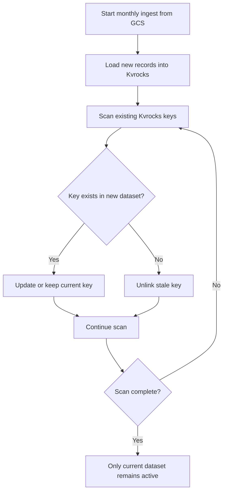
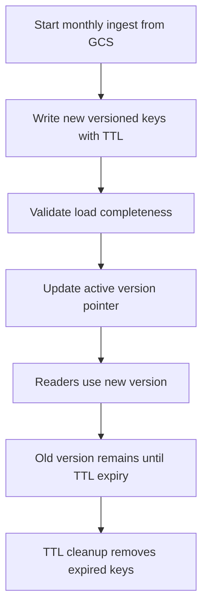
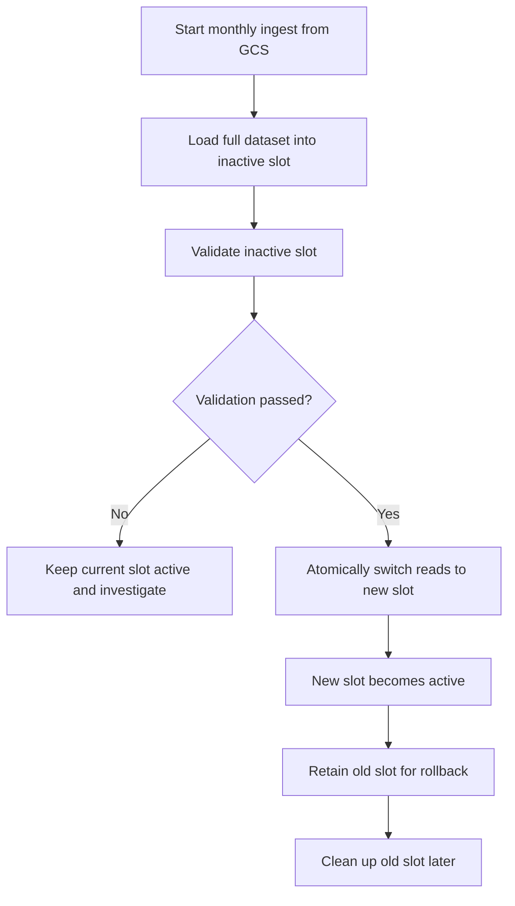
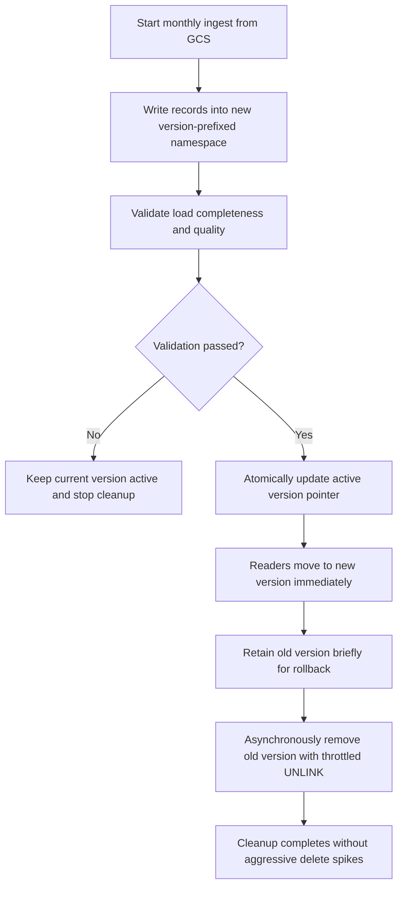

# GCS to Kvrocks Monthly Ingestion Approaches

## Summary

This document compares four approaches for ingesting a fresh monthly dataset from Google Cloud Storage (GCS) into Kvrocks. The main concerns are maintainability of the monthly ingestion workflow, resource usage during ingest and cleanup, stale-data exposure, rollback safety, operational complexity, and performance characteristics where they materially affect monthly operation.

For this monthly puller use case, maintainability and resource usage are the primary decision drivers because the pipeline runs infrequently and must remain easy to reason about, recover, and operate safely.

The business rule is strict: after a new monthly dataset is validated and cut over successfully, the system must not continue serving old data unless the business explicitly approves an exception. Based on that rule, this document recommends **Approach D: Version Prefix + Throttled UNLINK** as the default design.

## Problem Framing

The pipeline receives a full monthly refresh from GCS and loads it into Kvrocks. This is not a partial delta process. Each monthly ingest represents a new complete dataset that replaces the previous active dataset.

The design challenge is not just loading data quickly. It must also:

- remain easy to reason about and operate month after month,
- use storage and cleanup resources predictably,
- prevent the system from serving stale data after cutover,
- provide a safe rollback path if validation fails or business asks for fallback, and
- keep reads correct during cutover without making that the main decision driver, and
- keep the monthly ingest window and cleanup work bounded.

## Assumptions and Constraints

- The monthly load is a full refresh, not a partial delta.
- GCS is the source of truth for each monthly dataset.
- Kvrocks continues serving reads during or around ingest.
- Because this is a monthly puller, maintainability and bounded resource usage are more important than optimizing steady-state read/write throughput in isolation.
- Old data must not remain active after successful cutover unless business explicitly approves an exception.
- Cleanup must avoid avoidable load spikes on Kvrocks.
- Some temporary duplication during ingest is acceptable if it is bounded and operationally safe.
- This document stays at the architecture level and does not define code-level implementation details.

## Evaluation Criteria

The approaches are compared using the following criteria:

- **Maintainability:** How easy the design is to understand, operate, debug, and modify over time.
- **Resource usage during ingest and cleanup:** How much temporary storage overlap, cleanup work, and possible memory pressure the design creates.
- **Stale data cleanup behavior:** How reliably old data is removed or isolated after cutover.
- **Rollback capability:** How easy it is to return to the previous dataset if validation or business checks fail.
- **Recovery after partial failure:** How easy it is to recover from a failed load or interrupted cleanup process.
- **Read-path safety during cutover:** Whether readers can move to the new dataset without seeing stale data.
- **Operational complexity:** How much orchestration, validation, pointer management, and cleanup control the design requires.

## Approach A: SCAN + UNLINK

### How it works

This approach loads the monthly dataset into Kvrocks and then reconciles the database by scanning the existing keyspace. If a key exists in the new dataset, the loader updates it. If a key is not present in the new dataset, the system unlinks it.

This design tries to keep only one logical dataset in place. It minimizes long-term storage overlap, but it makes reconciliation part of the ingest path.

### Mermaid flowchart

### Performance and memory profile

This approach has the lowest steady-state storage overhead because it does not keep multiple versions for long. During ingest, it does not require a second full namespace.

The tradeoff is that load, reconciliation, and cleanup are all part of the same in-place monthly process. Large `SCAN` operations create O(N) work across the keyspace, and follow-up `UNLINK` calls still add cleanup work even if reclamation is asynchronous. For a large monthly dataset, this can extend the monthly job window and consume more database resources than a versioned cutover approach.

### Advantages

- Lowest long-term storage overhead.
- Direct model with no version pointer or namespace indirection.
- `UNLINK` is generally safer than blocking delete operations for stale-key cleanup.
- Attractive when minimizing storage overlap is the dominant goal.

### Risks and failure modes

- `SCAN` across a large keyspace is operationally heavy.
- Maintainability is weaker because the pipeline mutates the active namespace in place.
- Rollback is weak once stale keys begin to be unlinked from the active namespace.
- Partial failure can leave the dataset in a mixed state.
- Cleanup remains part of the in-place reconciliation path, which makes the process harder to reason about and recover safely.

### Fit for the monthly refresh use case

This approach is a reasonable fit when minimizing storage overlap is the dominant goal. It is less attractive when the team values predictable recovery, cleaner operational boundaries, and easier month-to-month maintenance.

## Approach B: SETEX + Version

### How it works

This approach writes each new monthly dataset under a version-aware scheme and sets a TTL on the data. After the new data is loaded, the system updates an active version pointer so readers use the new version. The previous version remains in storage until its TTL expires.

This makes ingest simple because cleanup is deferred to expiration rather than immediate reconciliation.

### Mermaid flowchart

### Performance and memory profile

This design keeps the ingest path mostly write-only, which is simpler to operate than scan-driven reconciliation. Rollback is also straightforward while the previous version still exists.

The cost is temporary overlap. During the TTL window, both old and new versions exist physically. Depending on dataset size and TTL length, storage footprint can approach 2x for the overlapping period. Memory usage may also rise, but it depends on access patterns, metadata overhead, and Kvrocks internals rather than doubling automatically. Compared with Approach A, maintainability is better because cleanup is deferred rather than intertwined with in-place reconciliation, but the resource model is less explicit because retirement depends on TTL timing.

### Advantages

- Simple ingest path with low operational friction.
- Easy rollback before old data expires.
- No heavy full-keyspace reconciliation step during cutover.
- Maintainability is better than in-place reconciliation because the data lifecycle is easier to operate.

### Risks and failure modes

- Old data still exists physically until TTL expiry.
- If any read path can still resolve old keys, the design violates the strict stale-data rule.
- Cleanup timing depends on TTL behavior rather than explicit operational control.
- Storage amplification remains until expiration completes.

### Fit for the monthly refresh use case

This approach is a reasonable fit when simplicity is valuable and brief version overlap is acceptable. It is not the best default for this use case because strict stale-data handling and explicit resource control matter more than TTL-driven retirement.

## Approach C: Blue/Green Swap

### How it works

This approach builds the full monthly dataset in an inactive slot, namespace, or logical environment. Once the load is complete and validated, the system atomically switches readers from the current slot to the new one. The previous slot is retained for rollback until cleanup runs.

This is a classic isolation model. Build first, validate second, switch only when ready.

### Mermaid flowchart

### Performance and memory profile

This design isolates ingest work from the active serving slot, which is good for cutover safety and maintainability. Reads stay stable until the atomic switch. Rollback is also clean because the old slot remains intact until cleanup.

The main cost is temporary duplication. In practice, this usually means near-2x storage during the overlap window. Memory pressure can increase as well, but it is workload-dependent. Cleanup is still required, and the design needs clear slot or namespace management, so the approach is strong on safety and maintainability but weaker on storage efficiency.

### Advantages

- Strong isolation between active and staging datasets.
- Clean cutover semantics.
- Clear rollback by switching the active slot back.
- Good safety for pre-cutover validation.

### Risks and failure modes

- Requires enough storage for overlapping full datasets.
- Cleanup of the old slot still needs its own operational strategy.
- Can be more infrastructure-heavy than necessary if a lighter versioned namespace design is sufficient.

### Fit for the monthly refresh use case

This approach is a strong fit when storage overhead is acceptable and the team values explicit isolation. It is safer than scan-based reconciliation, but it is often more expensive than needed if the same cutover and rollback properties can be achieved with a versioned prefix pattern.

## Approach D: Version Prefix + Throttled UNLINK

### How it works

This approach writes the new monthly dataset into a new version-prefixed namespace, such as `tdaa:version2:*`, while the current version stays active under a different prefix, such as `tdaa:version1:*`. After the new version is fully loaded and validated, the system atomically updates a single active version pointer so readers switch to the new namespace immediately.

The previous version is then removed asynchronously using throttled `UNLINK` or an equivalent controlled cleanup process. This decouples cutover from expensive deletion work.

### Mermaid flowchart

### Performance and memory profile

This approach creates temporary overlap during ingest, so storage footprint can approach 2x while both versions exist. The overlap is bounded and intentional. Memory pressure can also increase because more keys and metadata exist temporarily, but it is not inherently 2x.

The main operational advantage is that cutover, rollback, and cleanup are clearly separated. Ingest remains largely sequential and write-focused, while cleanup is decoupled from cutover. Throttled `UNLINK` reduces the chance of a large cleanup spike compared with immediate scan-and-unlink reconciliation. This gives the design a bounded and understandable resource profile without relying on in-place mutation.

### Advantages

- Zero-downtime cutover with clear active-version control.
- Strong protection against serving old data after pointer switch.
- Rollback remains possible until the old version is removed.
- Cleanup pressure is easier to control than aggressive in-place reconciliation.
- High maintainability because cutover, rollback, and cleanup are separated cleanly.
- Good balance between safety, bounded resource usage, and operational simplicity.

### Risks and failure modes

- Requires temporary overlap storage during ingest and rollback window.
- Needs disciplined version-pointer handling.
- Cleanup tooling must be throttled and observable so it does not silently lag or overload the database.

### Fit for the monthly refresh use case

This is the best fit for the stated business rule. It provides a strict cutover model, better recovery behavior than in-place reconciliation, more explicit stale-data control than Approach B, and a more resource-efficient operational model than Approach C for many monthly refresh cases.

## Comparison Matrix

| Criteria | Approach A: SCAN + UNLINK | Approach B: SETEX + Version | Approach C: Blue/Green Swap | Approach D: Version Prefix + Throttled UNLINK |
| --- | --- | --- | --- | --- |
| Maintainability | Weakest because the active namespace is reconciled in place | Moderate to strong because the ingest flow is simple, but TTL-based retirement is less explicit | Strong because staging, cutover, and rollback are clearly separated | Strongest balance because cutover, rollback, and cleanup are separated cleanly |
| Resource usage during ingest and cleanup | Lowest storage overlap, but requires full-keyspace scan plus reconciliation work every month | Higher overlap storage during TTL window; cleanup cost is deferred rather than explicitly controlled | Higher overlap storage because both slots coexist until cleanup | Bounded overlap storage with explicit, throttled cleanup behavior |
| Stale data cleanup | Immediate and complete after reconciliation | Complete only after TTL expiry | Complete after cleanup of old slot | Complete after explicit cleanup of old version |
| Rollback | Weak after stale keys begin to be unlinked | Strong until old version expires | Strong until old slot is removed | Strong until old version is removed |
| Recovery after partial failure | Weak because the active namespace may already be partially reconciled | Moderate to strong while the previous version still exists | Strong because the previous slot stays intact until cleanup | Strong because the previous version stays intact until cleanup |
| Read-path safety during cutover | Moderate because updates and cleanup happen in place | Strong if reads are strictly version-aware | Strong because reads switch only after slot validation | Strong because reads switch only after version validation |
| Operational complexity | Moderate because reconciliation logic and cleanup are tightly coupled | Low to moderate because the flow is simple, but TTL behavior must be managed | Moderate to high because slot lifecycle management is broader | Moderate because explicit version and cleanup control are required |
| Long-term storage cost | Lowest steady-state storage cost | Higher because of TTL overlap | Higher because of slot duplication | Moderate and bounded to version overlap period |

## Recommended Approach

The recommended default is **Approach D: Version Prefix + Throttled UNLINK**.

It is the best match for a monthly full-refresh pipeline with a strict cutover rule because it combines:

- strong maintainability,
- bounded resource usage during overlap and cleanup,
- reliable separation between old and new datasets,
- bounded rollback capability, and
- more explicit stale-data control than TTL-driven expiration.

Approach A is not recommended as the default because it relies on in-place reconciliation, makes recovery harder once stale keys start being removed from the active namespace, and couples cutover correctness to a full-keyspace cleanup process every month. Approach B is not recommended because it is operationally simple but too dependent on version overlap and TTL timing for a use case that demands strict stale-data handling and explicit resource control. Approach C is safe and valid, but it is often more storage-heavy and structurally broader than necessary if Approach D already gives clean cutover and controlled cleanup.

## Operational Safeguards and Business Exceptions

Regardless of the chosen design, the implementation must include:

- completeness validation before cutover,
- an explicit active-version pointer or equivalent cutover control,
- observability for ingest progress, validation status, and cleanup progress,
- a bounded rollback window, and
- rate control for cleanup work.

The only supported stale-data exception path is a business-approved fallback. In that case:

1. Keep the previous version namespace intact for a defined retention window.
2. Leave the active pointer on the previous version, or switch back to it if post-load validation fails.
3. Record the exception operationally so the temporary fallback is visible and auditable.
4. Delay cleanup of the old version until the exception window closes.

This exception path preserves business continuity without weakening the default rule that old data must stop serving after a successful cutover.

## Conclusion

For this monthly puller, the best default strategy is the one that stays easy to operate and recover while keeping resource overlap bounded. That makes **Version Prefix + Throttled UNLINK** the preferred default.

Another option can still make sense in narrow cases:

- Choose **SCAN + UNLINK** when storage efficiency is the dominant priority and the team accepts a harder recovery model.
- Choose **SETEX + Version** when simplicity is valuable and overlap storage is acceptable, but strict stale-data semantics are not absolute.
- Choose **Blue/Green Swap** when strong isolation and rollback are worth the extra storage cost.
- Choose **Version Prefix + Throttled UNLINK** when the goal is the best balance of maintainability, bounded resource usage, and strict cutover behavior.

Before implementation, the team must still define namespace conventions, active-pointer design, completeness checks, rollback window rules, cleanup throttling policy, and operational observability for both ingest and cleanup.
